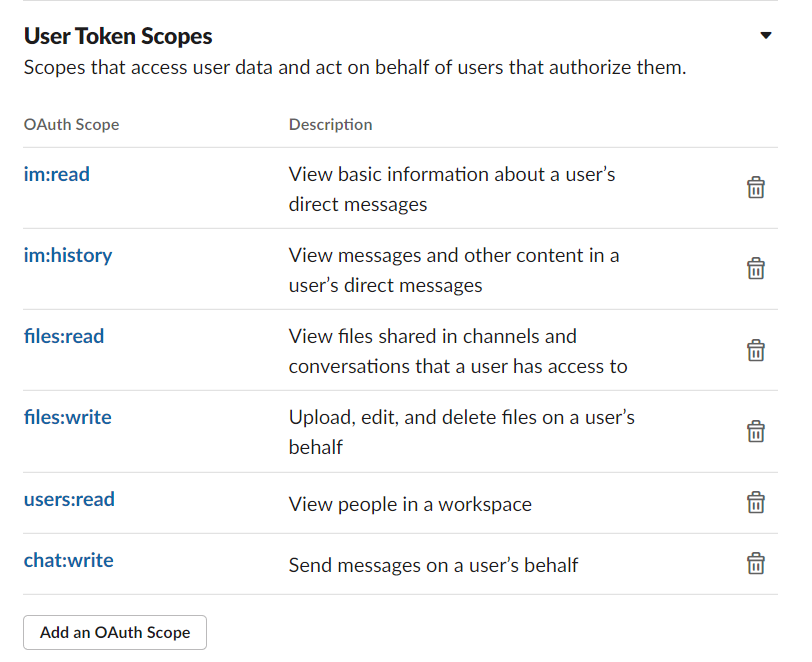

#### 1. Install slack-cleaner2 package for python

```
pip install slack-cleaner2
```

#### 2. Create a slack app

 1. Go to [Your Apps](https://api.slack.com/apps) &rarr; **Create New App** &rarr; **From scratch**
    (Use your **real name** to name your app. Develop your app in **NTUEESAAD 臺大電機學術部**)
    &rarr; **Create App**

 2. Edit your app's scope in **Features**&rarr;**OAuth & Permissions**&rarr;**Scopes**&rarr;**User Token Scopes**.
    Grant permissions as the following image.

    

 3. Click **Install to Workspace**&rarr;**Allow**

 4. The **User OAuth Token** will be applied to the python script in the next section.

    

#### 3. Backup and Delete Direct Messages

\*\* The backup tool provided is basic and only for pure text messages.\*\*

* Backup

  Paste your User OAuth Token to line 3 of `backup.py`, and modify **real_name** in line 10, line 15, line 17 to the property you wish to display in the record. You may want to design your own layout.

  

  

* Bulk Delete

​		Paste your User OAuth Token to line 2 of `clean.py`.

​		\*\* You should delete all direct messages by default, but you can uncomment line 5 to keep
​		some of your chats for special cases. \*\*
​		
​		Run clean.py. It should take plenty of time to delete all messages.

#### 4. Delete Your Slack App

​	\*\* Because at most 10 apps can coexist in a workspace, please remember to delete the app 	               	you created after use. \*\*

​	**Scroll to the bottom of your app's webpage, and Delete App**


